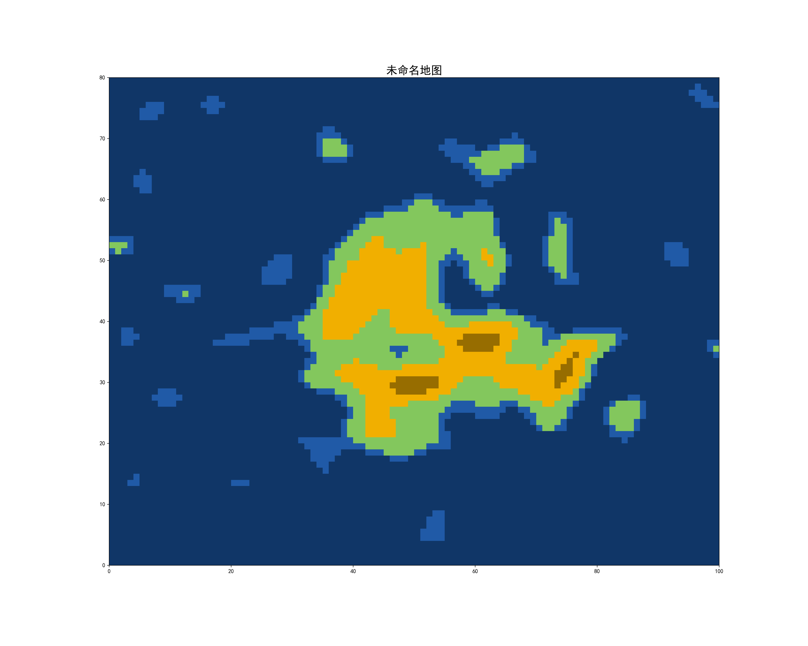
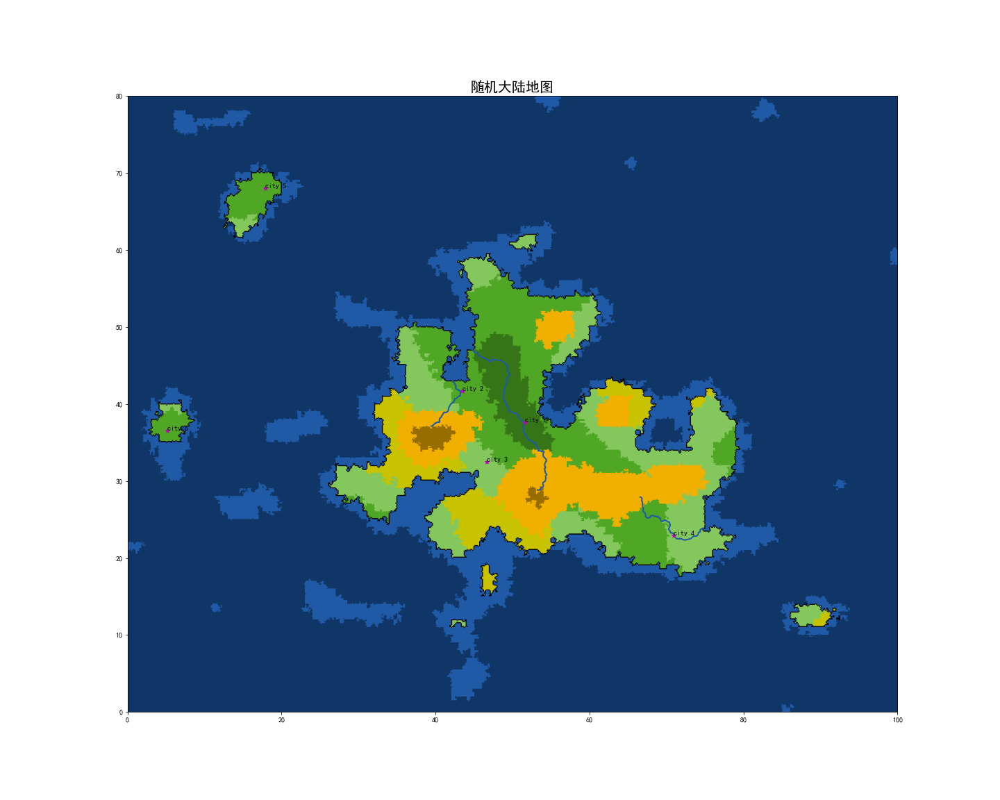

# mapmaker: 制作幻想世界的随机地图


## 基础生成

> <font color = Red>注意：需要安装 numpy 和 matplotlib。</font>

```python
# 最简单地图生成
In [1]: from mapmaker import Map

In [2]: m = Map()

In [3]: m.plot()
```


可以通过 `print` 查看地图的基本信息：
```python
In [4]: print(m)

        Map 未命名: 
            random seed: 518, 
            refine     : 0 cut times, 
            size       : 80 x 100
        Generate this map: 
            m = Map(name='未命名', seed='518')
            m.polish(0)
        Read this map: 
            m = Map('data/未命名/map.txt', name='未命名', cut_time=0, seed='518')

```
如希望再次创建此地图，可按照建议输入
```python
m = Map(seed=1586, name='随机大陆')
```
或从已生成地图的存储数据中读取
```python
m = Map('data/未命名/map.txt', name='未命名', cut_time=0, seed='518')
```

为了方便重建地图，建议使用随机种子。

地图数据会默认储存在当前路径下的 `data/“地图名字”` 文件夹中，所以建议为新生成的地图命名，否则可能会覆盖其他地图。

```python
# 指派随机种子的地图
In [5]: m = Map(seed=1586, name='随机大陆')
```

mapmaker 提供了自动优化地图的方法 `polish`，其参数包含优化轮次，通过 `detail=True` 可以查看每一轮次的优化结果，示例可见 `base.ipynb`。

```python
# 自动优化地图
In [6]: m.polish(3) # 优化3次
In [7]: m.plot()
```

绘制地图将默认保存该地图。
```python
In [7]: m.plot()
```


## 指派城市和河流

> <font color = Red>注意：指派城市和河流无法在 jupyter notebook 中进行。如使用 jupyter notebook 绘制地图，可另外使用一个 python 文件绘制城市和河流，数据将会储存在 data 文件中。重新在 jupyter notebook 创建同名地图时，会自动读取城市和河流数据并绘制。</font>

使用 `assign` 方法创建城市或河流，按照地图标题指示选点即可创建。一次可以创建多个城市，但只能创建一条河流。

```python
In [8]: m.assign('city')
In [9]: m.assign('river')   # 依次点击河流流经点，只需设置必要点，河流随机曲线将会自动随机创建
In [10]: m.assign('river')  # 继续创建第二条河流
In [11]: m.assign('river')  # 继续创建第三条河流
```



改变城市和河流的方法：
* 设置新城市：`set_city`
* 删除城市：`clear_city`
* 删除所有城市：`clear_all_city`
* 重命名城市：`rename_city`
* 设置新河流：`set_river`
* 删除河流：`clear_river`
* 删除所有河流：`clear_all_river`
* 微调河流：`change_river`

## 复杂大陆框架创建

生成复杂大陆时，需要首先生成高度图，导入 `AltitudeMap` 类。
```python
In [1]: from mapmaker import AltitudeMap, Map
```

最简单的生成多块大陆的方法是
```python
In [2]: p = AltitudeMap(continent_number=3)
```

此外，还有其他可调参数：
```python
In [2]: p = AltitudeMap(
        name='s7777', seed=7777,
        land_level=0.5, sea_level=0.2, noise_level=0.5, 
        continent_number=3, slope=5, width_range=(0.25,0.75), height_range=(0.25,0.75),
        perlin_cells=(20,10), 
        longtitude_range=200, latitude_range=80, resolution=1
)
```

通过 `print` 和 `plot` 了解生成结果。
```python
print(p)
p.plot('all')
```

确认生成结果后，根据高度图建立地图
```python
m = Map(p, name='多块大陆', seed='2222')
```


